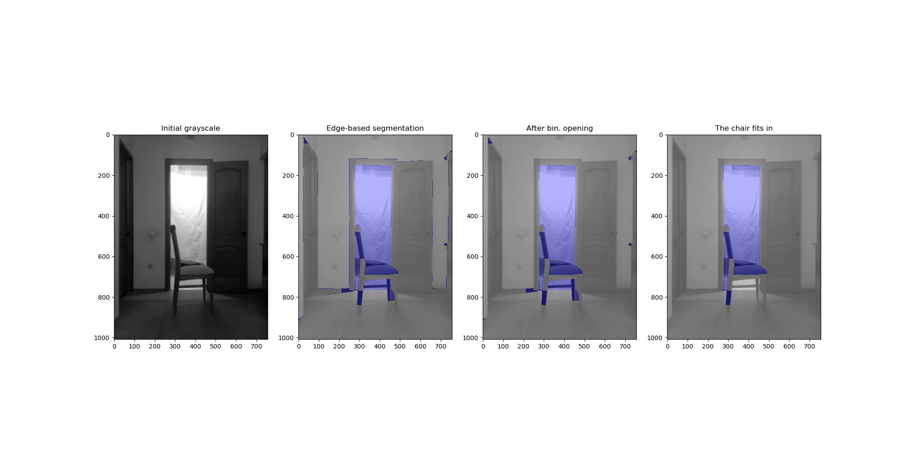

# Постановка задачи
Задача по умолчанию, требуется найти на изображении стул и дверной проем и определить, проходит стул в проем или нет.

# Наводящие соображения
Для начала давайте посмотрим, как работают методы, рассмотренные на лекциях, на нашем датасете. 
Возьмём первую фотографию из датасета:


Попробуем применить к ней разные алгоритмы бинаризации.
Неадаптивная бинаризация:


Заметим, что некоторые алгоритмы, в частности Otsu (которым мы будем в дальнейшем пользоваться), позволяют достаточно хорошо отделить внутренность дверного проема от остального изображения. Вероятно, это связано с тем, что в момент съемки за дверью горел свет, и дверной проем из-за этого ярче, чем его окружение.

Теперь попробуем применить алгоритмы адаптивной бинаризации:


Видим, что результат их работы сильно отличается от неадаптивных алгоритмов и дает сильно более подробное описание изображения, но, к сожалению, в наших целях оказывается бесполезен, так как по нему не удаётся выделить интересующие нас объекты. 

Попробуем применить другой подход к бинаризации. Заметим, что деревянные стул и дверь на изображении примерно одного и того же коричневого цвета. Реализуем собственную простую процедуру бинаризации, зададимся некоторым эталонным цветом (в данном случае был выбран цвет ножки стула) и бинаризуем цветное изображение по степени близости цвета пикселя к эталонному. Пиксели, которые отличаются от эталонного коричневого не сильнее некоторого порога, закрасим белым, остальные - черным. Сравним полученный результат с результатом Otsu:


Из-за неравномерной освещенности и наличия на изображении нескольких посторонних деревянных объектов, результат бинаризации по коричневому тоже оказался непригоден для выделения стула или двери. 

Так же давайте рассмотрим результаты применения различных фильтров для нахождения границ:


# Описание и примеры работы алгоритма

Ранее мы заметили, что бинаризация Otsu позволяет достаточно точно отделить дверной проем от остального изображения. Применим Otsu к исходному изображению, предварительно уменьшив его разрешение для того, чтобы быстрее выполнялись преобразования, а также применив размытие по Гауссу. После этого применим к результату бинаризации детектор границ Canny и преобразование Хафа для поиска прямых. Из найденного набора прямых, выбираем пару прямых которые наиболее вероятно являются образующими двери (прямые должны не сильно отличаться друг от друга по углу наклона и быть относительно вертикальными). Если получилось найти такую пару, вычисляем среднее расстояние между этими прямыми (считаем расстояние от точки пересечения первой прямой с границей изображения до второй прямой и расстояние от точки пересечения второй прямой с границей изображения до первой прямой, затем берем среднее арифметическое этих двух расстояний), это расстояние будем называть средней шириной двери. Рассмотрим, как это работает на нашем примере:


На картинке красным отмечена выбранная пара прямых, а зеленым - отрезки, длины которых используются при вычислении средней ширины. Как видим, на этом изображении дверь определилась верно. Однако, в некоторых случаях прямые найти не удается, или в качестве двери выбирается не та пара прямых, как, например, на следующем изображении:Door%20lines%20fail.png


Далее попробуем найти стул с помощью анализа компонент связности. Применим к изображению детектор границ Canny, затем морфологическое открытие, процедуру binary_fill_holes из библиотеки scipy и наконец морфологическое открытие, чтобы избавиться от шумов. Затем проанализируем получившиеся компоненты связности. В случае, если не удалось найти линии, образующие дверь по результату Otsu, то попробуем сделать то же самое, но уже по результату разбиения на компоненты связности. Компонента с наибольшей площадью скорее всего является дверным проемом (или его частью). В некоторых случаях, эта компонента так же включает в себя элементы стула. Рассмотрим все пиксели этой компоненты, если среди них есть такие, которые находятся далеко за дверным проемом, то скорее всего это элементы стула, не пролезающие в дверь (так как в реальности дверь довольно узкая, и стул пролезает в неё без запаса, то для упрощения мы искусственно слегка увеличим её ширину):



На первом изображении ни один из пикселей главной компоненты связности не вышел за границы дверного проема дальше, чем на искусственно увеличенную ширину. На втором изображении вышедшие за границы пиксели отмечены красным. Так же заметим, что в обоих случаях применение морфологического открытия позволило избавиться от ненужных линий в компонентах связности. 

Если найдены пиксели главной компоненты, не пролезающие в дверь, то считаем, что стул в дверь не проходит. Если таких пикселей не найдено, это может говорить как о том, что стул проходит, так и о том, что нужные элементы стула просто не попали в одну компоненту связности с внутренностью проема. Поэтому, рассмотрим так же вторую по площади компоненту связности. Будем считать, что если её площадь не слишком сильно меньше площади первой, а также у неё достаточно большое отношение площади к периметру (это говорит о том, что компонента не является просто линией, отрезком какой-то границы изображения, а является двумерным объектом с соизмеримыми длиной и шириной), то эта компонента является элементом стула. Если такой компоненты не найдено, или все её пиксели так же проходят в дверной проем, то считаем, что стул проходит в дверь. В противном случае, считаем, что не проходит. Ниже приведен пример изображения, на котором стул оказался во второй по величине компоненте связности:


В завершение заметим, что такая сегментация работает далеко не идеально, например, на этом изображении алгоритм выдает неверный ответ, так как спинка и задняя ножка стула не попали ни в одну из компонент связности:


# Требования к установке
```
pip install numpy
pip install matplotlib
pip install scipy
pip install -U scikit-image
```
